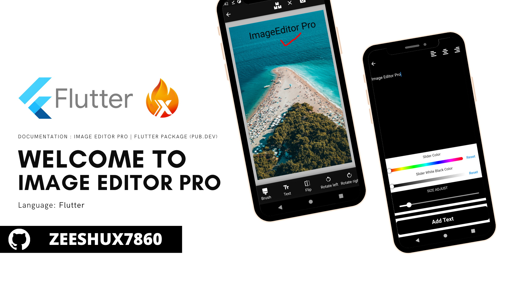

# ImageEditorPro

Image Editor Plugin with simple, easy support for image editing using Paints, Text, Filters, Emoji and Sticker like stories.

To start with this, we need to simply add the dependencies in the gradle file of our app module like this

## Installation

First, add `image_editor_pro:` as a [dependency in your pubspec.yaml file](https://flutter.io/platform-plugins/).

Import

```dart
import 'package:image_editor_pro/image_editor_pro.dart';
```

### iOS

Add the following keys to your _Info.plist_ file, located in `<project root>/ios/Runner/Info.plist`:

* `NSPhotoLibraryUsageDescription` - describe why your app needs permission for the photo library. This is called _Privacy - Photo Library Usage Description_ in the visual editor.
* `NSCameraUsageDescription` - describe why your app needs access to the camera. This is called _Privacy - Camera Usage Description_ in the visual editor.
* `NSMicrophoneUsageDescription` - describe why your app needs access to the microphone, if you intend to record videos. This is called _Privacy - Microphone Usage Description_ in the visual editor.

Or in text format add the key:

``` xml
<key>NSPhotoLibraryUsageDescription</key>
<string>Used to demonstrate image picker plugin</string>
<key>NSCameraUsageDescription</key>
<string>Used to demonstrate image picker plugin</string>
<key>NSMicrophoneUsageDescription</key>
<string>Used to capture audio for image picker plugin</string>
```

### Android

No configuration required - the plugin should work out of the box.

Add this function to Your StateFull Widget Check the [Example](https://github.com/zeeshux7860/Image_editor_pro_package/blob/master/example/lib/main.dart)

```dart
 Future<void> getimageditor()  {
    final geteditimage =   Navigator.push(context, MaterialPageRoute(
        builder: (context){
          return ImageEditorPro(
            appBarColor: Colors.blue,
            bottomBarColor: Colors.blue,
          );
        }
    )).then((geteditimage){
      if(geteditimage != null){
        setState(() {
          _image =  geteditimage;
        });
      }
    }).catchError((er){print(er);});

  }
```

## Developed By
- [Zeeshan](https://www.linkedin.com/in/zeeshu-x-5190b41a1/)

## Special Thanks
Sanskar Tiwari


## Credits
- This project is inspired from [PhotoEditor by Burhanuddin Rashid](https://github.com/burhanrashid52/PhotoEditor)


## MIT License

Copyright (c) 2020 Zeeshux7860

Permission is hereby granted, free of charge, to any person obtaining a copy
of this software and associated documentation files (the "Software"), to deal
in the Software without restriction, including without limitation the rights
to use, copy, modify, merge, publish, distribute, sublicense, and/or sell
copies of the Software, and to permit persons to whom the Software is
furnished to do so, subject to the following conditions:

The above copyright notice and this permission notice shall be included in all
copies or substantial portions of the Software.

THE SOFTWARE IS PROVIDED "AS IS", WITHOUT WARRANTY OF ANY KIND, EXPRESS OR
IMPLIED, INCLUDING BUT NOT LIMITED TO THE WARRANTIES OF MERCHANTABILITY,
FITNESS FOR A PARTICULAR PURPOSE AND NONINFRINGEMENT. IN NO EVENT SHALL THE
AUTHORS OR COPYRIGHT HOLDERS BE LIABLE FOR ANY CLAIM, DAMAGES OR OTHER
LIABILITY, WHETHER IN AN ACTION OF CONTRACT, TORT OR OTHERWISE, ARISING FROM,
OUT OF OR IN CONNECTION WITH THE SOFTWARE OR THE USE OR OTHER DEALINGS IN THE SOFTWARE.
